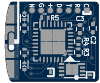

# THIS PROJECT HAS BEEN ABANDONED!

The Tomu+ has been abandoned and is not under development.

 
 
 
 
 
 
 
 
 
 
 
 
 
 
 
 
 
 
 
 
 
 
 
 
 
 
 
 
 
 
 
 
 
 
 
 
 
 
 

----

# [Tomu+, I'm](tomu.im)

[I'm Tomu+](tomu.im) a *improved* tiny ARM microprocessor which fits in your USB port.
I have two buttons and two LEDs.

## Contact

 * [Announcement mailing list](https://groups.google.com/forum/#!forum/tomu-announce/join) - Low traffic list for announcements.
 * [Discussion mailing list](https://groups.google.com/forum/#!forum/tomu-discuss/join) - List for discussing development / new features / etc.
 * [IRC Channel - irc://irc.freenode.net/#tomu](https://webchat.freenode.net/?channels=#tomu) - IRC channel for discussing anything related to the project.

## WARNING: This design hasn't been proven yet!

Built out of a 3d printed part + 2 layer "thin" PCB (0.4mm or 0.6mm thick).

The board has;
 * 6mil traces
 * 6mil clearance
 * 0.3mm drill / 0.6mm vias

--

Uses a Freescale Semiconductor / NXP Kinetis KL27 (MKL27Z256VFM4) ([datasheet](http://cache.freescale.com/files/32bit/doc/data_sheet/KL27P64M48SF6.pdf)).

The important features are;
 * [~$5.00 USD on Digikey](https://www.digikey.com.au/product-detail/en/freescale-semiconductor-nxp/MKL27Z256VFM4/MKL27Z256VFM4-ND/4988919)
 * QFN32 - 5mm x 5mm package
 * Inbuilt 5V to 3V3 regulator.
 * Crystal-less USB

These make something which is almost hand solder-able fit into the tiny size.

## BOM

All parts are ordered from Digikey but could easily be ordered from somewhere else.

 * [Digikey BOM in CSV format](bom-digikey.csv)

Individual parts;

 * Resistors
  - 2 x 0402 - 33 Ohm - [Digikey](https://www.digikey.com.au/short/35385r)
  - 2 x 0402 - ~50 Ohm (Depends on LED choice)
  - 1 x 0402 - 10k Ohm

 * Capacitors - [Digikey Capacitors 0402, >1uF](https://www.digikey.com.au/short/3m8r4z)
  - 1 x Capacitor ~2.2uF 0402
  - 1 x Capacitor ~4.7uF 0402

 * 2 x LED 0402
  - You choice of two different colors (might require adjustment of R1/R2).
  - 5mA LEDs are better choice.
  - Get highest millicandela rating you can.
  - [Digikey Search of LEDs in 0402 package](https://www.digikey.com.au/short/3m8rz0)

 * 1 x MKL27Z256VFM4 - [Digikey](https://www.digikey.com.au/short/353852)

 * (Optional) 1 x Atmel ATECC508A Auth IC - [Digikey](https://www.digikey.com.au/short/35385n)

## TODO

 * Create the device
 * Create the 3d print model.
 * Write the firmware for the device.

## FAQ

##### Why did you create this?

The aim was to prove that a device which fits in your USB port could be created
**by hobbists in small quantities** extremely cheaply.

##### Where does the name Tomu come from?

TOMU comes from the abbreviation "Tim's Open Micro USB".

##### What can I use this for?

What ever you want! If you do create something, please send me the info!

## License

The contents of this repository excluding "third_party" folder is released
under your choice of the following two licences:

 * the "Creative Commons Attribution-ShareAlike 4.0 International License"
   (CC BY-SA 4.0) full text of this license is included in the LICENSE file
   and a copy can also be found at
   http://creativecommons.org/licenses/by-sa/4.0/

 * the "TAPR Open Hardware License" full text of this license is included
   in the LICENSE file and a copy can also be found at
   http://www.tapr.org/OHL

